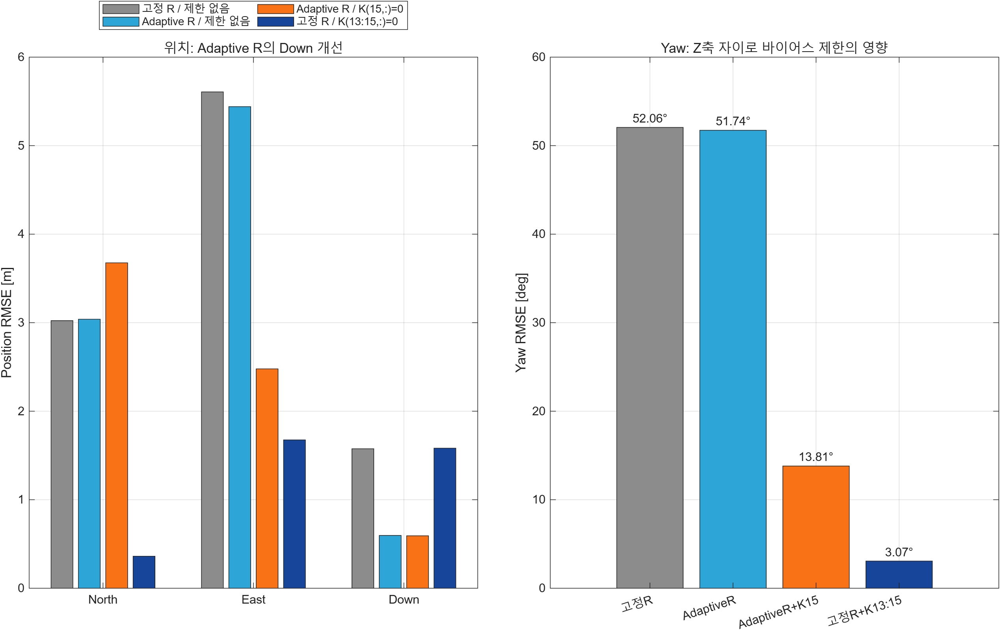

# INS/GNSS EKF Navigation

IMU와 GNSS 측정값을 결합하는 loosely coupled 15-state EKF 기반 항법 프로젝트입니다. 초기 정렬, INS 전파, GNSS 보정, 기준 항법해와의 오차 분석 및 P/Q/R 튜닝 실험을 포함합니다.

## Repository structure

```text
.
├── src/                 # 실행 코드와 항법/기하 함수
│   ├── Main.m           # 기본 EKF 실행 진입점
│   ├── navigation/      # 정렬, 전파, GNSS 보정
│   ├── geometric/       # 자세·좌표 계산 보조 함수
│   └── INSToolbox/      # INS 계산 보조 함수 모음
├── data/                # 센서 입력 및 기준 항법 데이터
├── experiments/         # P/Q/R 튜닝 재현 스크립트
├── results/             # 실험 지표 CSV와 결과 그래프
└── docs/                # 프로젝트 발표 자료
```

| 경로 | 내용 | 관리 기준 |
|---|---|---|
| `src/Main.m` | 기본 INS/GNSS EKF 실행 및 오차 시각화 | 핵심 코드 |
| `src/navigation/` | 초기화, 정렬, INS 전파, GPS 보정 | 핵심 코드 |
| `src/geometric/` | 쿼터니언·오일러각 등 기하 연산 | 핵심 코드 |
| `src/INSToolbox/` | 항법 계산에 필요한 보조 함수 | 의존 코드 |
| `data/` | `Sens_data.mat`, `True_data.mat` | 재현용 입력 데이터 |
| `experiments/` | 튜닝 케이스 일괄 실행 및 선택 그래프 재생성 | 실험 코드 |
| `results/` | 최종 지표와 발표에 사용한 그래프 | 재현 결과 |
| `docs/` | 최종 발표 자료 | 문서 |

## Run

MATLAB에서 저장소 루트를 현재 폴더로 설정한 뒤 실행합니다.

```matlab
run(fullfile(pwd, 'src', 'Main.m'))
```

전체 튜닝 실험을 다시 실행하려면 다음 명령을 사용합니다. 실행 결과는 `results/`에 저장되며, 용량이 큰 재생성 가능 MAT 결과는 Git에서 제외됩니다.

```matlab
addpath(fullfile(pwd, 'experiments'))
run_all_experiments
```

## Result preview



세부 케이스별 수치는 [`results/ekf_case_metrics.csv`](results/ekf_case_metrics.csv), GNSS 이상 구간 지표는 [`results/gnss_anomaly_metrics.csv`](results/gnss_anomaly_metrics.csv)에서 확인할 수 있습니다.

## Data

- `Sens_data.mat`: IMU 및 GNSS 측정 데이터
- `True_data.mat`: VN-300 기준 항법 데이터

두 데이터 파일은 실행 재현을 위해 한 벌만 보관합니다.
